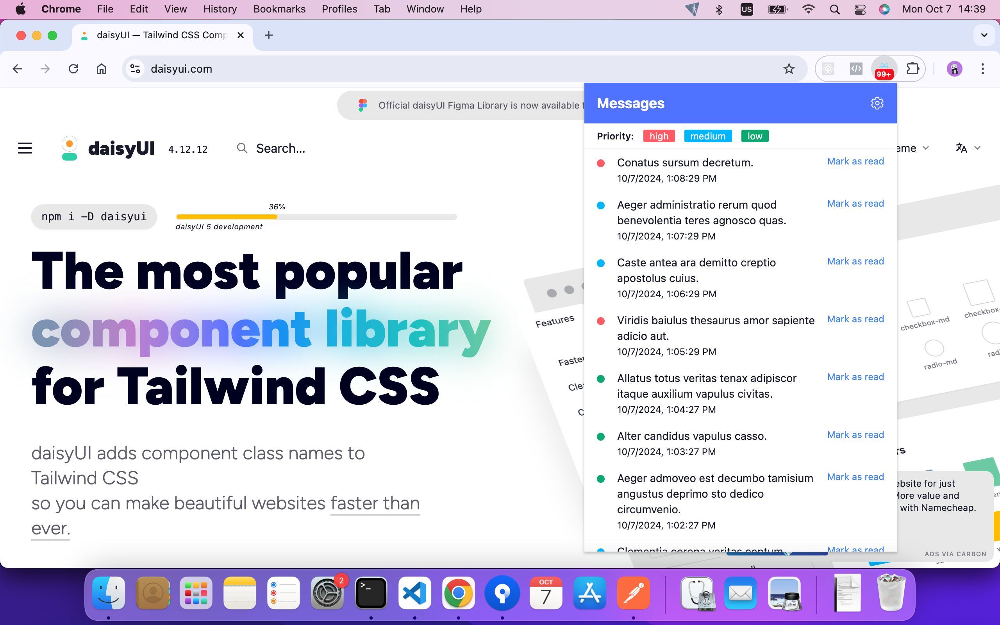
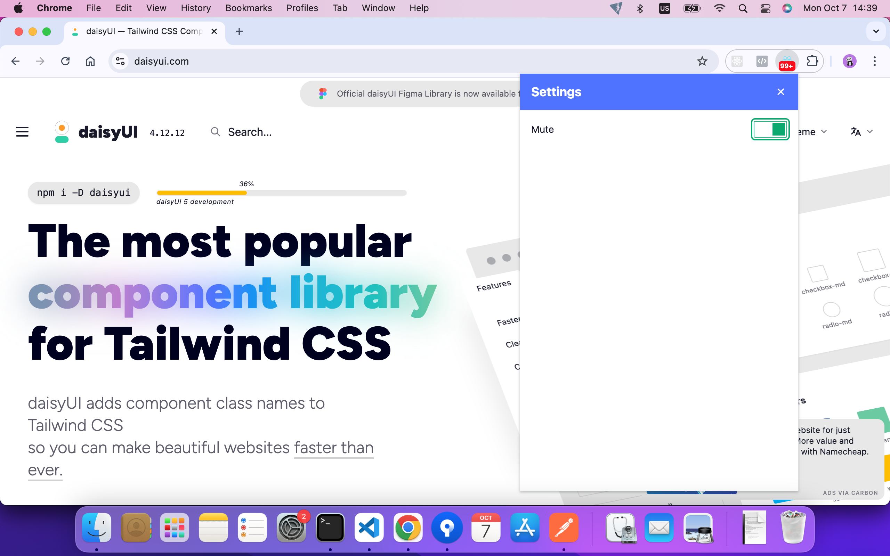
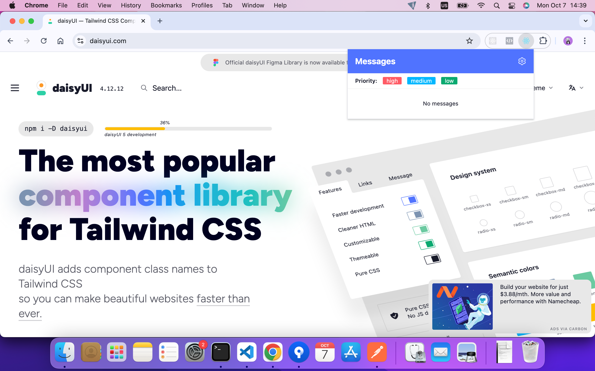
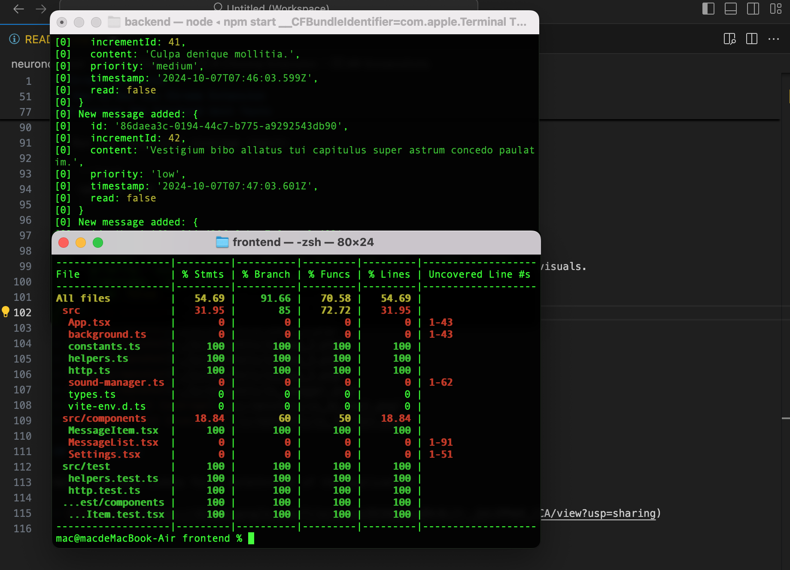

# Chrome Extension

## Table of Contents

- [Project Overview](#project-overview)
- [How to Run the App](#how-to-run-the-app)
- [How to Run the Unit Tests](#how-to-run-the-unit-tests)
  - [Backend Tests](#backend-tests)
  - [Frontend Tests](#frontend-tests)
- [Screenshots](#screenshots)
- [Demo Videos](#demo-videos)

## Project Overview

Chrome browser extension that displays organization-wide messages from an admin to users. Built using React, Vite and CRXJS plugin and written in TypeScript.

## How to Run the Backend API

To run the API locally, follow these steps:

1. Clone the repository:

    ```bash
    git clone <repository-url>
    cd <repository-folder>
    ```

2. Make sure you are using Node v20 or later.

3. In the root directory, cd to the backend folder:

    ```bash
    cd backend
    ```

4. Install the dependencies:

    ```bash
    npm install
    ```

5. Run the json-server:

    ```bash
    npm start
    ```

6. The API is running at:
    - [Backend API | JSON Server](http://localhost:5000)

## How to Run the Chrome Extension

### Installing the Chrome Extension

1. The extension is bundled in the dist folder which is not gitignored.

2. Open Google Chrome browser.

3. Go to Manage Extensions in the top right menu or enter `chrome://extensions` in the url bar.

4. Enable the `Developer mode` in the top right corner:

5. Click `Load unpacked` in the top left corner.

6. Select the dist folder which is located in the frontend folder.

7. Open the extension.

8. There's no messages initially. Wait for several minutes until a few messages are added. A new message is added every 1 minute.

9. You can also rebuild the project by running these scripts in the frontend folder:

    ```bash
    npm install
    ```

    ```bash
    npm run build
    ```

### Running the Frontend Unit Tests

1. I only wrote some tests because the time is limited.

2. From the root folder, go to the frontend folder and install the dependencies:

    ```bash
    cd frontend
    ```

    ```bash
    npm install
    ```

3. Run the tests with coverage report:

    ```bash
    npm run test
    ```

## Screenshots

Include screenshots of the application, test coverage, and any other relevant visuals.

- 
- 
- 
- 

## Demo Videos

Watch the demo videos for a walkthrough of the application:

- [Demo Video](https://drive.google.com/file/d/1Uwt7Gn0ROdFaDM2uORi7SzYIaDzel_aj/view?usp=drive_link)
